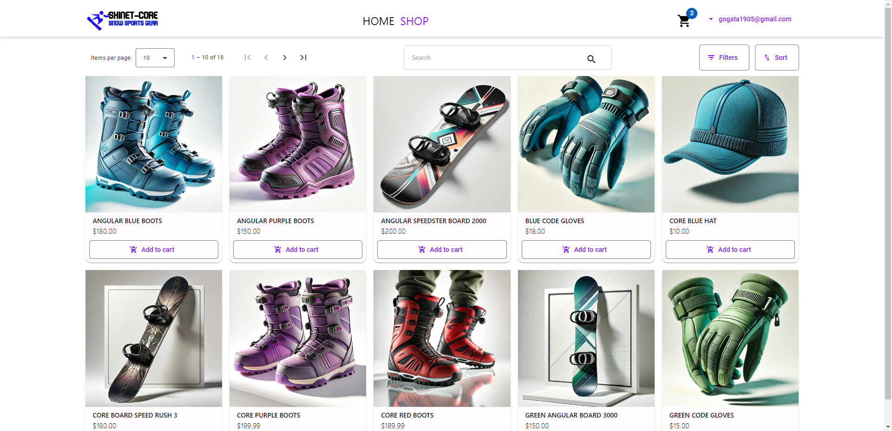
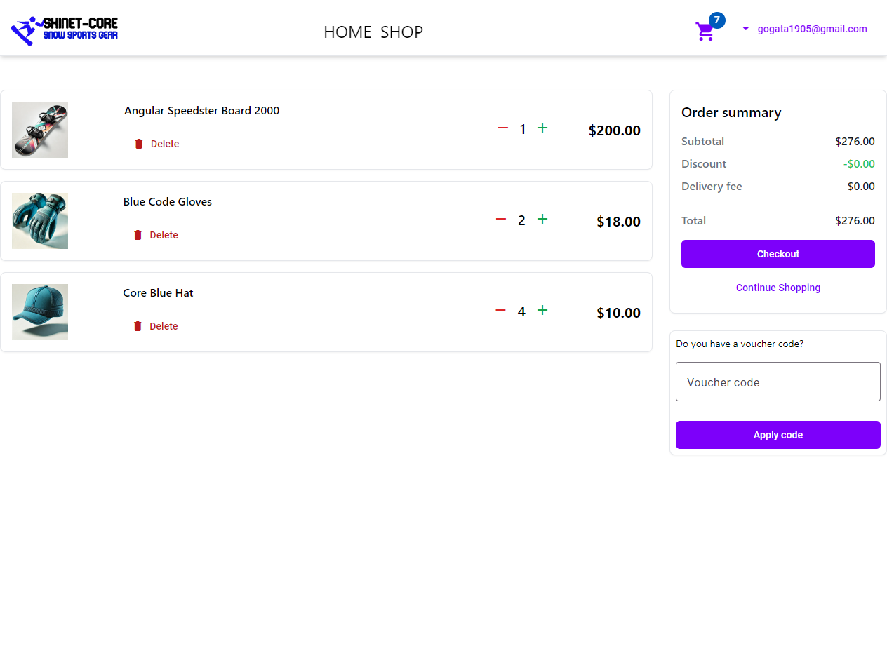

Ski_Shop-.NET-Angular-Project-001

# Ski_Shop

## Introduction

This project is a full-stack application built with .NET on the backend and Angular on the frontend. It serves as an e-commerce platform with features like user authentication, product browsing, and an integrated shopping cart.

## Features

- .NET REST API
- Angular
- TypeScript
- Stripe Payment and Discounts
- Filters, Sorting, Pagination
- Roles

## How to use?

- 0.Download the repository, extract it to folder and open with Visual Studio Code

Open Terminal in "API" folder:

- 1.Add appsetting.json with:

```
{
  "Logging": {
    "LogLevel": {
      "Default": "Information",
      "Microsoft.AspNetCore": "Information"
    }
  },
  "StripeSettings": {
    "PublishableKey": "Your PublishableKey",
    "SecretKey": "Your SecretKey",
    "WhSecret": "Your WhSecret"
  },
  "AllowedHosts": "*"
}
```

- 2.dotnet run

Open Terminal in "client" folder:

- 1.npm install
- 2.ng serve
- 3.Start on: https://localhost:4200/

## Photos

1. **Dashboard**
   

2. **Cart**
   

3. **Order Step 1 - Add Address**
   

4. **Order Step 2 - Shipping Type**
   

5. **Order Step 3 - Stripe Payment**
   

6. **Order Step 4 - Confirmation**
   

7. **Discount**
   

8. **Product Details**
   

9. **Filters**
   

10. **Sorting 1**
    

11. **Sorting 2**
    

12. **Dropdown**
    

13. **Home**
    

14. **Login**
    

15. **Register**
    

16. **Order Confirmation**
    

17. **Orders**
    

18. **Order Details**
    
